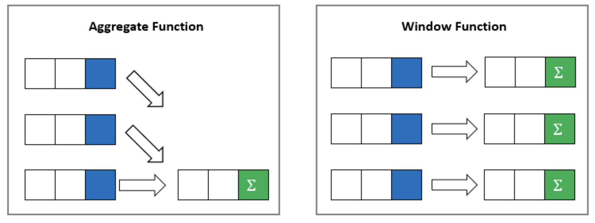

# Window Functions

This chapter covers window functions. Window functions leverage aggregate functions to take a deeper look into data sets.

Window funtions can be identified by the `OVER()` keyword.


## Resources to Browse Before Class

- [Intro to Window Functions](https://www.toptal.com/sql/intro-to-sql-windows-functions)
- [SQL Window Functions](https://www.sqltutorial.org/sql-window-functions/)
- [SQL Tutorial - Window Functions](https://www.youtube.com/watch?v=H6OTMoXjNiM)


## Window Functions

Aggregrate functions aggregate data and return a single row. But what if you want to see counts as well as the breakdowns of individual records? This is where Window Functions come into play.

Window functions take aggregate data and displays them in context with more detailed data.

  

Let's say your customer wants a list of total sales per employee in the database.

A `SUM()` with a `GROUP BY` would give us this

```sql
select
	sales.employee_id,
	sum(sales.price) total_employee_sales
from
	employees
join
	sales
on
	sales.employee_id = employees.employee_id
group by
	sales.employee_id
```

The issue with this, is that you can't put names with the employees using a group by. You could put the select in a CTE or a subquery, or you could use a window function.

The `OVER()` function is what makes this a windows function. The default for `OVER()` is the entire rowset. It will apply the function--`SUM()`--to the entire dataset, in this case total sales. If we want to break the data into parts, we partition it by the data we want to group it by. In this query, we are partitioning by the employee id so get total sales per employee.

By running a windows function, we can get the employee's name, as well as aggregate queries all in one query.

```sql
select distinct
	employees.last_name || ', ' || employees.first_name employee_name,
	sales.employee_id,
	sum(sales.price) over() total_sales,
	sum(sales.price) over(partition by employees.employee_id) total_employee_sales
from
	employees
join
	sales
on
	sales.employee_id = employees.employee_id
order by employee_name
```

You can use windows functions to write many of the reports in the upcoming chapters.
