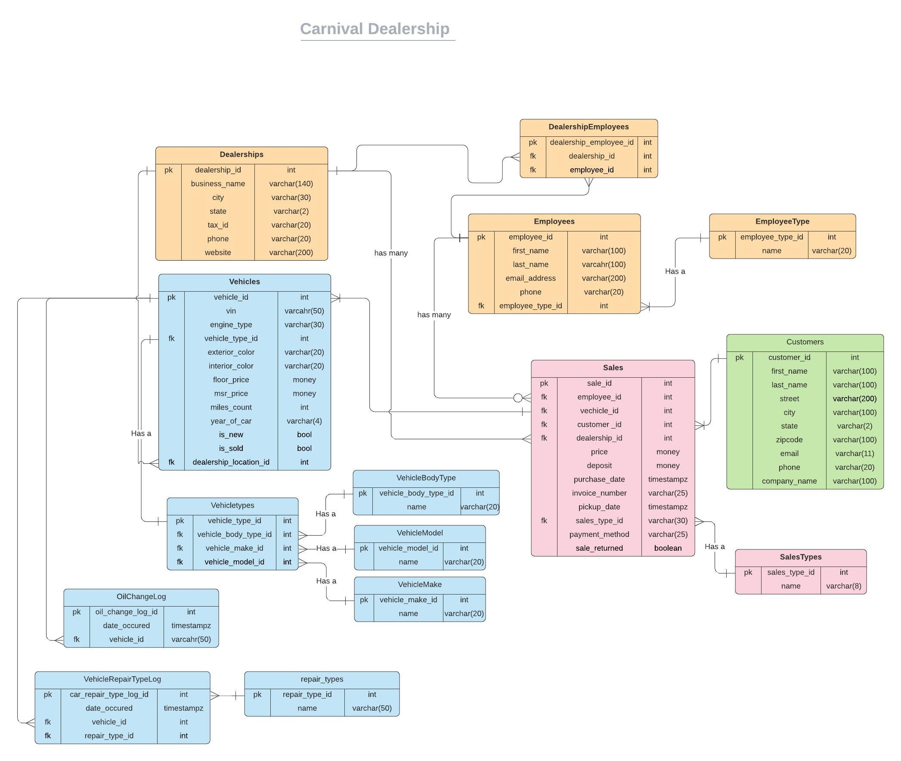

Carnival has decided to reevaluate their database and see if they can optimize the existing structure and improve query performance times. 

# Part 1: Normalizing the Carnival Database

Carnival's intern Monique had extra time to really get familiar with database normalization and data relationships and found that she could improve her ERD. Below is the ERD that she thinks will improve the quality of her database. Use this ERD as the basis for the following group work. For the first part of this project, your team is tasked with creating a script to apply these changes.  

Use the Carnival ERD to identify the tables that are still missing in your database.

1. Which tables need to be created after reviewing the ERD?
2. What levels of normalization will these new tables be supporting?
3. Do any of these tables have a foreign key in another table? What is the child table that would hold the foreign key(s).

## Consider

  - What needs to be created or modified?  Don't just consider tables, but foriegn keys and other table modifications as well.
  - What data needs needs to change or move?  See note on Data Migration below
  - What needs to be deleted?
  - Does order matter?  What order should tasks be completed in?  
 
## Data Migration

What is a data migration? It is simply moving/changing your data from one location to another.

A data migration will need to take place for Carnival where we will convert text to integers. The result of the script will change all the text words to id integers. The important thing to note is that the data migration script does not change the datatype of these fields. You will be respnonsible for changing the datatype in the next practice below.

# Part 2: Optimizing Carnival Database

The second part of this team project is designed for your team to analyze the entire database and create a .SQL script file that will execute the improvements to make the database better. Consider Carnival's business as well.  Are there Views, Stored Procedures or Triggers that will help Carnival operate more effiecently?

Discuss the improvements as a team and why they would provide a benefit to the business. Please draw on all the knowledge you have gotten from this course to implement your ideas!  Once you have found some improvements, create a .Sql script to implement those improvements.  

## Things you might find useful

1. Creating tables
2. Altering exsiting tables
3. Drop statements
4. Views
5. Triggers (Formatting data or ensuring new related records get created)
6. Stored Procedures that group functionality
7. Transactions
8. Indexing
9. Data migrations
10. Normalizing the database further vs denormalizing
