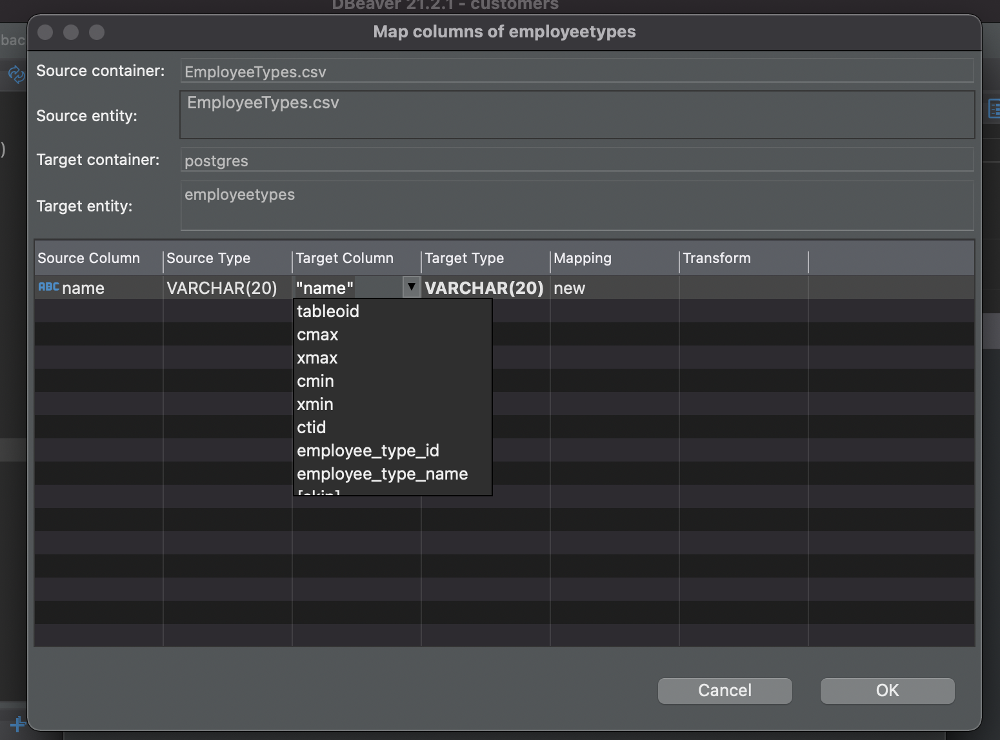

# Importing Data

This chapter will prepare you in the initial steps of creating a new database, setting up tables and importing new data.

## Tools

1. PostgreSQL - Installed from the Getting Started Chapter.
2. DBeaver - Installed from the Getting Started Chapter.
3. Reference for [DBeaver Documentation](https://dbeaver.com/docs/wiki/)

## Goals

After reading this chapter, doing the exercises, and engaging in discussion with your instructor and peers, you should be able to execute the following skills in DBeaver.

1. Creating a new database
2. How to import SQL statements via a .sql file
3. How to import data via a .csv file

## Carnival's Next Steps

Before Carnival can import their CSV data to the database they need to FIRST create a database and THEN define the tables' schemas using SQL.

Instead of hiring a SQL expert, Carnival decided to save money and assign a task to their super smart intern, Monique. Monique's task is to create a database and prepare the SQL statements required to set up the Carnival database table schemas. Monique chose to save her SQL statements in a .sql file which she plans to import and run. Then, and only then, can Monique do another import of the data from the Carnival .csv files.

[Download Monique's .sql file here](./database/carnival_db_schemas.sql), we will use it to create the carnival database table schemas. We'll see how she did!

[Download Carnival CSVs](https://github.com/nashville-software-school/sql-professional/raw/master/book-1-carnival-design/chapters/data/csv%20files.zip)

## Creating a new database

For this course you will use DBeaver for all of your database interactions. DBeaver is a software that connects to the local databases on your computer. It's important to note that this is not a cloud-based software. It is in fact installed on your machine.

### How to create a database with DBeaver?

1. Open DBeaver. Once you launch DBeaver, you should see a Database navigator on the left-hand side of the screen.
2. Right click on *postgres* and hover over *Create* and then click on *Database*.
3. Then, simply name the database 'carnival' and click *Save*.
4. You should now be able to see your new database nested under the *Databases* directory.

## Importing SQL statements via .sql file

Now we are ready to import the tables schemas. We will do this with Monique's .sql file.

1. Right click on your newly created 'carnival' database.
2. Tools -> Execute script ->
3. For the input file, naviate to the downloaded version of Monique's .sql file.
4. Click Proceed.

All of the tables schema information lives in the Schemas directory.

## Importing data via .csv files

Now that the database and tables are ready, Monique can import the actual data from Carnival's .csv files.

[Download Carnival CSVs](https://github.com/nashville-software-school/sql-professional/raw/master/book-1-carnival-design/chapters/data/csv%20files.zip)

1. Within the Schemas directory you will see a listing of the tables in the database. Right click on the Customers table and select Import Data.
1. The Import/Export data modal will allow you to specify how to import the data. Chose 'Import from CSV file'.
1. Chose the appropriate CSV file for the 'Input file' that corresponds to the table you are importing for. Click 'Next'. Click 'Next' on the following 2 screens as well.
1. Click 'Start'.
1. *Important note*: The order in which you import each table matters. Hint: Tables with that refer to other tables (via foreign keys) will need to have their data imported after the tables they are dependent on.
1. For `Employee_Types`, `Sales_Types`, and `Repair_Type`, you will have to re-map the names of some columns in the columns from the csv file to the names in the SQL script. For `Employee_Types`, map the column name `name` to `employee_type_name`. Do the same for `sales_type_name` and  `repair_type_name` in the other two tables.

Tips: 
- The order you import data is important.  Take some time to think through whether foreign keys you need exists.  For example, if you try to import the vehicles, but there is no data in the vehicletypes table, there will be a foreign-key constraint error. 
- If you try to import data and an error is thrown, you may need to delete and recreate the table.  
- Make sure that the id column starts with 1 after you do an import.  If it is not, you may need to delete the table and start over. 

